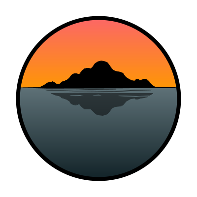

# IsleForge: Stylized 3D Island Creator

## Description
Creating unique and distinctive 3D environments is a critical aspect of game development, particularly for stylized games that emphasize hand-made aesthetics. However, most existing terrain generation tools often rely on noise-based procedural methods. These are effective for realistic landscapes, but they are ill-suited for more stylized environments. This project, IsleForge: Stylized 3D Island Creator, aims to fill that gap by providing a tool that mixes hand crafting and procedural generation, prioritizing the design elements. The goal is to make it easier for developers to create high-quality island assets that fit their aesthetic, without having to create every piece of terrain from scratch.
The significance of this project is its ability to streamline the creation process while preserving creative control. Terrain like this is something that is used less and less, as the scope of games requires generation tools, due to the time-intensive nature of sculpting them by hand. By offering an intuitive and efficient workflow, IsleForge empowers developers(particularly indie creators and small teams) to quickly produce diverse island terrains without sacrificing artistic intent.
The primary beneficiaries of this project are independent game developers and 3D artists seeking a fast, customizable way to create ocean-based terrain. By reducing the time commitment to getting these assets made, this project should help creators make artistic terrain for projects that  incorporate ocean exploration or island-based settings.

## Demo

https://github.com/user-attachments/assets/bca4dc87-894c-465f-bf37-902b8dc55927

## Purpose
This is my capstone project for school, and I will be working on it for the next few weeks.
